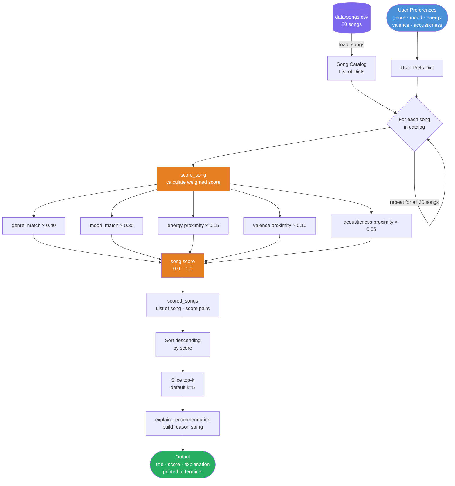

# Music Recommender — Data Flow Diagram

This diagram traces the full pipeline from user input and CSV catalog to ranked recommendations.



## Scoring Formula

```
score = (0.40 × genre_match)
      + (0.30 × mood_match)
      + (0.15 × energy_proximity)
      + (0.10 × valence_proximity)
      + (0.05 × acousticness_proximity)

where proximity = 1.0 - abs(user_value - song_value)
      match     = 1.0 if equal else 0.0
```

## Stage-by-Stage Summary

| Stage | Function | Input | Output |
|---|---|---|---|
| Load | `load_songs()` | `data/songs.csv` | `List[Dict]` — 20 song dicts |
| Score | `score_song()` | 1 song + user prefs | float 0.0–1.0 |
| Rank | `recommend_songs()` | all scored songs | sorted top-k list |
| Explain | `explain_recommendation()` | 1 song + user prefs | reason string |
